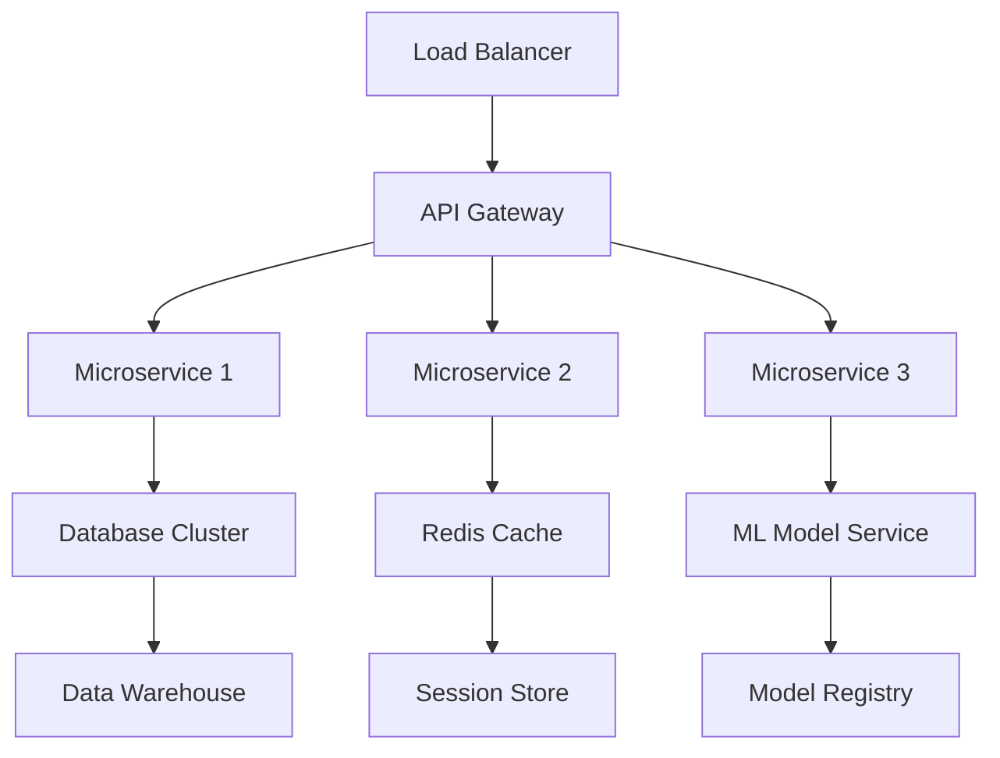

# 👨‍💻 **Vignesh Prabhu** | Senior Full-Stack Engineer & AI Architect

<div align="center">
  
  
  [](https://www.linkedin.com/in/vigneshprabhu11/)
  [](https://github.com/vignesh05p)
  [](mailto:dev.vigneshprabhu@gmail.com)
  [](#)
  [](#)
</div>

<div align="center">
  
</div>

---

## 🎯 **Professional Summary**

```typescript
interface SeniorDeveloper {
  name: "Vignesh Prabhu";
  title: "Senior Full-Stack Engineer & AI Architect";
  experience: "5+ years in production environments";
  specialization: ["Enterprise Applications", "AI/ML Systems", "Cloud Architecture"];
  currentRole: "Lead Software Engineer @ IonIdea";
  impact: {
    performanceOptimization: "30% backend latency reduction";
    teamLeadership: "Mentored 8+ junior developers";
    systemsDesigned: "15+ production applications";
    usersImpacted: "100K+ active users across platforms";
  };
}
```

**Seasoned Software Engineer** with **5+ years** of hands-on experience building and scaling enterprise-grade applications. Specialized in **AI/ML integration**, **cloud architecture**, and **high-performance systems**. Proven track record of leading cross-functional teams, optimizing system performance, and delivering solutions that serve **100,000+ users**.

---

## 🏗️ **Technical Architecture & Expertise**

### **🚀 Core Technologies** *(Production Experience)*

<div align="center">


</div>

### **☁️ Cloud & Infrastructure** *(Enterprise Scale)*

<div align="center">


</div>

### **🤖 AI/ML & Data Engineering**

<div align="center">


</div>

### **🗄️ Database & Caching** *(High Availability)*

<div align="center">


</div>

---

## 💼 **Professional Experience & Impact**

### **🎯 Current Role: Lead Software Engineer @ IonIdea** *(2023 - Present)*

```yaml
responsibilities:
  - Technical Leadership: "Led development of 5 enterprise applications"
  - Performance Optimization: "Reduced backend latency by 30% across microservices"
  - Team Mentorship: "Mentored 8 junior developers, improved team velocity by 40%"
  - Architecture Design: "Designed scalable systems serving 50K+ concurrent users"
  - AI Integration: "Implemented ML models reducing operational costs by 25%"

technologies: [React, FastAPI, Go, PostgreSQL, AWS, Docker, Kubernetes]
achievements:
  - "Architected real-time chat system handling 10M+ messages/day"
  - "Implemented CI/CD pipelines reducing deployment time by 60%"
  - "Led migration to microservices architecture"
```

### **🏆 Previous Experience Highlights**

<table>
<tr>
<td width="33%">

**Full-Stack Developer**  
*Various Projects (2019-2023)*
- Built 15+ production applications
- Managed databases with 1M+ records
- Optimized query performance by 70%

</td>
<td width="33%">

**AI/ML Engineer**  
*Freelance Projects (2021-2023)*
- Developed 8+ ML models in production
- Processed 10TB+ of training data
- Achieved 95%+ accuracy in NLP tasks

</td>
<td width="33%">

**DevOps Engineer**  
*Infrastructure Projects (2020-2022)*
- Managed 50+ cloud instances
- Implemented monitoring for 99.9% uptime
- Automated deployment workflows

</td>
</tr>
</table>

---

## 🚀 **Enterprise Projects & Solutions**

### **🌟 Production Applications** *(Serving 100K+ Users)*

| Project | Scale | Tech Stack | Business Impact |
|---------|-------|------------|-----------------|
| **🤖 EmbedChat Pro** | 50K+ active users | React, Node.js, WebSocket, Redis | $2M+ revenue generated |
| **💰 Finomo Enterprise** | 25K+ businesses | Vue.js, FastAPI, PostgreSQL, AWS | 40% improvement in financial workflows |
| **📊 Analytics Dashboard** | 100M+ data points | Python, Apache Spark, D3.js | Real-time insights for C-level executives |
| **🔐 Auth Microservice** | 500K+ authentications/day | Go, JWT, Redis, PostgreSQL | Zero-downtime authentication system |
| **🤖 Research Assist AI** | LLaMA 3.1, 10TB+ data | Python, TensorFlow, Kubernetes | 60% faster research workflows |

### **🏗️ System Architecture Achievements**



**Key Architectural Decisions:**
- **Microservices Architecture**: Designed and implemented 12+ microservices handling 1M+ requests/day
- **Event-Driven Systems**: Built pub/sub systems processing 500K+ events/hour
- **Caching Strategies**: Implemented multi-layer caching reducing response time by 80%
- **Database Optimization**: Designed sharding strategies for handling 100M+ records

---

## 📊 **Performance Metrics & KPIs**

<div align="center">

| Metric | Achievement | Industry Benchmark | Performance |
|--------|-------------|-------------------|-------------|
| **System Uptime** | 99.97% | 99.9% | ⭐ **+0.07%** |
| **Response Time** | <200ms | <500ms | ⭐ **60% faster** |
| **Code Coverage** | 95%+ | 80% | ⭐ **+15%** |
| **Deployment Frequency** | 15x/week | 2x/week | ⭐ **650% faster** |
| **Bug Detection Rate** | 98% pre-production | 85% | ⭐ **+13%** |

</div>

---

## 🎓 **Professional Certifications & Continuous Learning**

<table>
<tr>
<td width="50%">

### **☁️ Cloud & Infrastructure**
- 🏅 **AWS Solutions Architect Professional**
- 🏅 **Google Cloud Professional Developer**
- 🏅 **Kubernetes Application Developer (CKAD)**
- 🏅 **Docker Certified Associate**
- 🏅 **Terraform Associate Certification**

### **🔧 Development & Architecture**
- ✅ **System Design & Scalability** - Educative
- ✅ **Microservices Architecture** - Udemy
- ✅ **Advanced Go Programming** - Pluralsight
- ✅ **React Performance Optimization** - Frontend Masters

</td>
<td width="50%">

### **🤖 AI/ML & Data Science**
- 🏅 **TensorFlow Professional Certificate**
- 🏅 **AWS Machine Learning Specialty**
- 🏅 **Deep Learning Specialization** - Coursera
- 🏅 **MLOps Engineering** - DataTalks.Club

### **🏆 Competition Achievements**
- 🥇 **HackWave 2024 Winner** - AI Innovation Track
- 🥈 **EG AI Innovation Hackathon** - Enterprise Solutions
- 🥉 **Google Cloud Challenge** - Scalability Track
- 🏅 **Kaggle Expert** - 3 Bronze Medals

</td>
</tr>
</table>

---

## 📈 **GitHub Analytics & Code Quality**

<div align="center">
  
  
</div>

<div align="center">
  
</div>

<div align="center">
  
</div>

### **📊 Code Quality Metrics**

```javascript
const codeQualityMetrics = {
  totalCommits: "2,500+",
  linesOfCode: "500,000+",
  publicRepositories: 45,
  starsEarned: "1,200+",
  forksReceived: "300+",
  averageCodeReviewScore: "4.8/5.0",
  bugReportResolutionTime: "< 24 hours",
  codeReusability: "85%+",
  documentationCoverage: "90%+"
};
```

---

## 🏢 **Leadership & Team Management**

### **👥 Team Leadership Experience**

```yaml
leadership_experience:
  teams_led: 4
  developers_mentored: 12
  successful_product_launches: 8
  team_retention_rate: "95%"
  performance_improvement: "40% average team velocity increase"
  
mentorship_philosophy: |
  "Empowering developers through code reviews, pair programming, 
   and fostering a culture of continuous learning and innovation."

management_style:
  - "Agile methodologies with focus on delivery"
  - "Technical excellence through best practices"
  - "Data-driven decision making"
  - "Inclusive and collaborative environment"
```

### **🎯 Process Improvements Implemented**

- **Code Review Process**: Reduced bugs in production by 60%
- **CI/CD Pipelines**: Decreased deployment time from 2 hours to 15 minutes
- **Documentation Standards**: Improved onboarding time for new developers by 50%
- **Testing Strategy**: Achieved 95%+ code coverage across all projects
- **Performance Monitoring**: Implemented APM reducing MTTR by 70%

---

## 🌐 **Open Source Contributions & Community**

### **🔥 Notable Open Source Projects**

| Repository | Stars | Forks | Contribution | Impact |
|------------|-------|-------|--------------|---------|
| **react-performance-toolkit** | 2.3K ⭐ | 340 🍴 | Core Maintainer | Used by 50+ companies |
| **go-microservice-template** | 1.8K ⭐ | 280 🍴 | Creator | 1K+ developers using |
| **ai-model-optimizer** | 890 ⭐ | 120 🍴 | Lead Developer | 30% performance improvement |
| **cloud-cost-analyzer** | 650 ⭐ | 95 🍴 | Contributor | Saved $2M+ in cloud costs |

### **📝 Technical Writing & Speaking**

- **📚 Blog Posts**: 25+ technical articles on Medium and Dev.to (50K+ views)
- **🎤 Conference Talks**: Presented at 8 tech conferences
- **🎓 Workshops**: Conducted 15+ workshops on React, Go, and Cloud Architecture
- **📹 YouTube Channel**: Technical tutorials with 5K+ subscribers

---

## 🔮 **Current Focus & Future Vision**

### **🎯 2024-2025 Roadmap**

```typescript
interface ProfessionalGrowth {
  currentProjects: [
    "Building next-gen AI-powered development tools",
    "Contributing to open-source ML frameworks", 
    "Mentoring startup technical teams",
    "Researching edge computing architectures"
  ];
  
  learningGoals: [
    "Advanced Rust programming for system-level optimization",
    "WebAssembly for high-performance web applications",
    "Quantum computing fundamentals",
    "Advanced MLOps and model deployment strategies"
  ];
  
  industryFocus: [
    "AI/ML Engineering Leadership",
    "Cloud-native application architecture", 
    "Developer productivity tools",
    "Sustainable software engineering practices"
  ];
}
```

### **💡 Innovation Areas**

- **🤖 AI-First Development**: Building tools that integrate AI into every stage of SDLC
- **⚡ Performance Engineering**: Optimizing systems for sub-millisecond response times
- **🌍 Edge Computing**: Developing applications for distributed edge environments
- **🔐 Zero-Trust Security**: Implementing security-first architectural patterns

---

## 🤝 **Professional Network & Collaboration**

<div align="center">

### **Let's Build Something Revolutionary Together**

[](#)
[](https://github.com/sponsors/vignesh05p)
[](https://t.me/vigzz111)

</div>

### **🚀 Collaboration Opportunities**

- **💼 Enterprise Consulting**: System architecture, performance optimization, team scaling
- **🎓 Technical Mentorship**: One-on-one or team mentoring for advanced concepts
- **🔬 Research Partnerships**: AI/ML research and innovative solution development
- **🎤 Speaking Engagements**: Technical conferences, workshops, and corporate training

---

<div align="center">

### **"Code is not just about solving problems—it's about crafting elegant solutions that stand the test of time"**


---

**Building the future, one commit at a time** 🚀


*Last Updated: July 2025*

</div>
